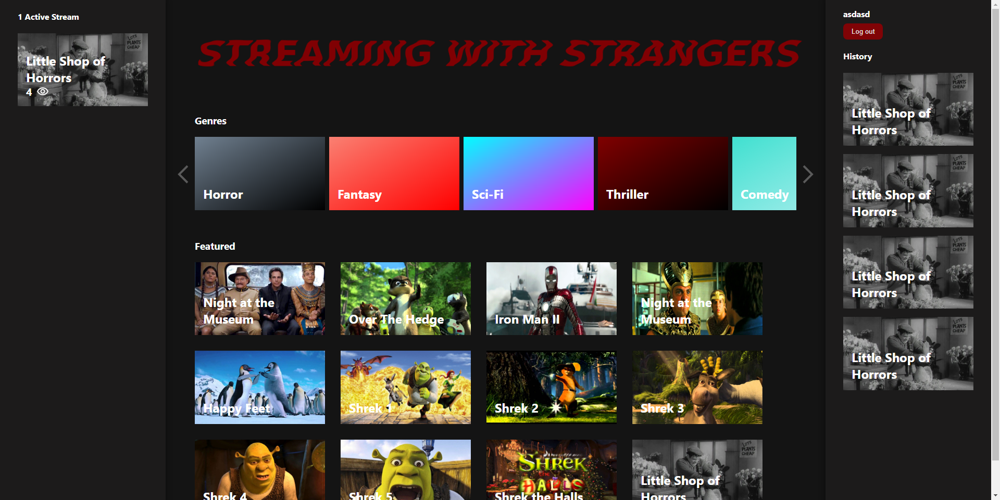

# Streaming with Strangers

https://devpost.com/software/streaming-with-strangers

# Inspiration

Realizing that people spend a LOT of time streaming tv and movies, and then reflecting on how much we enjoyed watching movies with friends over winter break.

# What it does

Streaming with Strangers offers a selection of movies to choose from and creates a room when one person starts a movie. Then, other users can join into that room and talk using the built-in chat feature.

# How we built it

We started by discussing all the requirements for a project. Then we split up and created a flask webserver and react front-end. Our original plan was to use a csv file as a locally stored database but after beginning development we quickly decided to create a postgreSQL database to store everything. we built up the front and back end of the project separately in the first morning and afternoon then spent the rest of our time testing and connecting the front-end to the back-end.

# Challenges we ran into

Our first challenge that we ran into was not having a database, we overcame this fairly quickly by creating a postgreSQL database and modifying our API to send SQL queries instead of reading and writing csv files. Our next big issue was in getting our two factor authentication to work. We spent over an hour attempting to get it to work but after discussing as a team it turned out that the person who was testing the 2FA had a time issue with their computer that was causing all the issues. Our next major issue was connecting the back-end to the front-end. This was because there were errors in both parts that needed to be ironed out before we could fully connect them. This challenge was overcome by individually testing each of our API calls and bug-fixing the front-end.
Accomplishments that we're proud of

    Two factor authentication
    Custom login solution
    Functioning chat rooms
    Video streaming
    Interactive website

# What we learned

At the start of this hackathon only two of our team members were familiar with the front-end framework we were using and only one of us was familiar with the back-end framework. This hackathon provided us the opportunity to learn react, flask, a bit of SQL, and database creation. We also learned how valuable planning and communication are in a short-term project. Because we started our process by planning out every API call and designing the website, we spent the rest of the time working without ever having to think about what needed to get done. We also discussed any changes that we made to our original plan and maintained a master document for all API calls with their responses, this communication meant that everyone constantly understood the scope of the project and all the requirements.

Youtube Link to Presentation (6:23-11:53)
https://www.youtube.com/watch?v=z0b2zSOL2CM
